# Documentación de Arquitectura - Sistema de Gestión Broncopulmonar

> **Versión**: 1.0  
> **Fecha**: 20 de Enero, 2026  
> **Proyecto**: Sistema de Gestión de Rehabilitación Broncopulmonar

---

## 1. Introducción

### 1.1 Propósito
Este documento describe la arquitectura técnica del Sistema de Gestión Broncopulmonar, incluyendo componentes, tecnologías, patrones de diseño y diagramas UML que ilustran la estructura y comportamiento del sistema.

### 1.2 Alcance
La documentación cubre:
- Arquitectura general del sistema
- Estructura de base de datos (ERD)
- Componentes principales
- Flujos de interacción
- Patrones de diseño implementados
- Stack tecnológico

---

## 2. Arquitectura General del Sistema

### 2.1 Vista de Alto Nivel

El sistema sigue una arquitectura **serverless** basada en Next.js 16 con patrón de **App Router** y renderizado del lado del servidor (SSR).

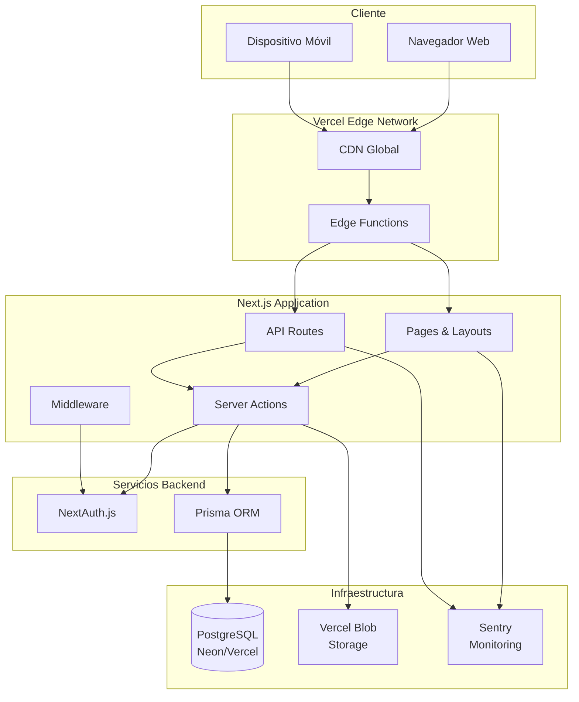

### 2.2 Arquitectura en Capas

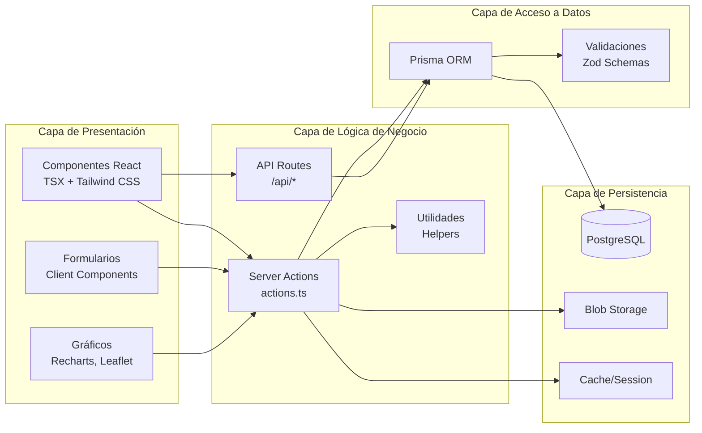

---

## 3. Modelo de Datos

### 3.1 Diagrama Entidad-Relación (ERD)

```mermaid
erDiagram
    User ||--o{ SystemLog : creates
    Patient ||--o{ Appointment : has
    Patient ||--o{ MedicalExam : has
    Patient ||--o{ PulmonaryFunctionTest : undergoes
    Patient ||--o{ Notification : receives
    
    User {
        string id PK
        string email UNIQUE
        string rut UNIQUE
        string password
        string name
        string role
        boolean active
        boolean mustChangePassword
        datetime createdAt
        datetime updatedAt
    }
    
    Patient {
        string id PK
        string email UNIQUE
        string password
        string name
        string rut UNIQUE
        boolean active
        string phone
        string commune
        string region
        string gender
        string address
        datetime birthDate
        string healthSystem
        float cota
        datetime diagnosisDate
        datetime createdAt
        datetime updatedAt
    }
    
    Appointment {
        string id PK
        string patientId FK
        datetime date
        string status
        string notes
        datetime createdAt
        datetime updatedAt
    }
    
    MedicalExam {
        string id PK
        string patientId FK
        string source
        string uploadedByUserId
        string centerName
        string doctorName
        datetime examDate
        string fileUrl
        string fileName
        boolean reviewed
        datetime createdAt
        datetime updatedAt
    }
    
    PulmonaryFunctionTest {
        string id PK
        string patientId FK
        datetime date
        float cvfValue
        int cvfPercent
        float vef1Value
        int vef1Percent
        int dlcoPercent
        float walkDistance
        int spo2Rest
        int spo2Final
        int heartRateRest
        int heartRateFinal
        string notes
        datetime createdAt
    }
    
    Notification {
        string id PK
        string type
        string title
        string message
        string patientId FK
        string examId
        boolean read
        datetime createdAt
    }
    
    SystemLog {
        string id PK
        string action
        string details
        string userId
        string userEmail
        string ipAddress
        datetime createdAt
    }
    
    RolePermission {
        string id PK
        string role
        string action
        boolean enabled
        datetime updatedAt
    }
    
    PasswordResetToken {
        string id PK
        string email
        string token UNIQUE
        datetime expires
        datetime createdAt
    }
    
    MedicalKnowledge {
        string id PK
        string title
        string content
        string category
        string imageUrl
        datetime createdAt
        datetime updatedAt
    }
```

### 3.2 Descripción de Entidades Principales

#### User (Usuario Interno)
Representa a los profesionales y personal administrativo del sistema.
- **Roles disponibles**: ADMIN, KINESIOLOGIST, RECEPTIONIST
- **Campos clave**: email único, contraseña encriptada, estado activo
- **Relaciones**: Registra acciones en SystemLog

#### Patient (Paciente)
Representa a los pacientes del programa de rehabilitación.
- **Autenticación separada**: Sistema de login independiente
- **Datos clínicos**: Sistema de salud, cota, fecha de diagnóstico
- **Ubicación**: Comuna y región para análisis geográfico

#### MedicalExam (Examen Médico)
Almacena archivos de exámenes médicos subidos por pacientes o profesionales.
- **Storage**: URLs apuntan a Vercel Blob Storage
- **Revisión**: Flag para marcar si fue revisado por un profesional
- **Fuente**: Indica si fue subido desde portal paciente o interno

#### PulmonaryFunctionTest (Evaluación Funcional)
Registra resultados de pruebas de función pulmonar.
- **Espirometría**: CVF y VEF1 con valores absolutos y porcentajes
- **DLCO**: Porcentaje de difusión pulmonar
- **TM6M**: Test de marcha con SpO2 y frecuencia cardíaca

#### RolePermission (Permisos por Rol)
Sistema de control de acceso basado en roles (RBAC).
- **Granular**: Permisos específicos por acción
- **Configurable**: El administrador puede modificar permisos
- **Restricción única**: Combinación (role, action) debe ser única

---

## 4. Arquitectura de Componentes

### 4.1 Estructura de Directorios

```
Sistema_Gestion_Broncopulmonar/
├── src/
│   ├── app/                      # Next.js App Router
│   │   ├── (public)/            # Rutas públicas (login, registro)
│   │   ├── (patient)/           # Portal de pacientes
│   │   ├── (internal)/          # Portal interno
│   │   ├── api/                 # API Routes
│   │   └── layout.tsx           # Layout raíz
│   ├── components/              # Componentes React
│   │   ├── ui/                  # Componentes base (shadcn/ui)
│   │   ├── DashboardContent.tsx # Dashboard interno
│   │   ├── PatientsManagementTable.tsx
│   │   ├── PulmonaryChart.tsx   # Gráficos de evaluaciones
│   │   ├── Map.tsx              # Mapa de distribución
│   │   └── ...
│   ├── lib/                     # Lógica de negocio
│   │   ├── actions.ts           # Server Actions principales
│   │   ├── auth.ts              # Configuración NextAuth
│   │   ├── prisma.ts            # Cliente Prisma
│   │   └── utils.ts             # Utilidades
│   └── types/                   # Definiciones TypeScript
├── prisma/
│   ├── schema.prisma            # Esquema de base de datos
│   ├── seed.ts                  # Datos iniciales
│   └── migrations/              # Migraciones
├── public/                      # Assets estáticos
├── e2e/                         # Tests E2E (Playwright)
├── scripts/                     # Scripts de utilidad
└── docs/                        # Documentación
```

### 4.2 Diagrama de Componentes Principales

```mermaid
graph TB
    subgraph "Portal Pacientes"
        PPLayout[Patient Layout]
        PPDashboard[Patient Dashboard]
        PPExams[My Exams]
        PPTests[My Tests]
        PPProfile[My Profile]
        PPBooking[Booking Interface]
    end
    
    subgraph "Portal Interno"
        IPLayout[Internal Layout]
        IPDashboard[Dashboard]
        IPPatients[Patients Table]
        IPBI[BI Reports]
        IPAdmin[Admin Panel]
    end
    
    subgraph "Componentes Compartidos"
        Navbar[Navigation Bar]
        Sidebar[Sidebar]
        Forms[Form Components]
        Charts[Chart Components]
        Map[Map Component]
    end
    
    subgraph "Server Actions"
        AuthActions[Authentication]
        PatientActions[Patient CRUD]
        ExamActions[Exam Management]
        TestActions[Test Management]
        AdminActions[Admin Actions]
    end
    
    PPDashboard --> Navbar
    PPDashboard --> Charts
    PPExams --> Forms
    PPTests --> Charts
    PPBooking --> Forms
    
    IPDashboard --> Sidebar
    IPPatients --> Forms
    IPBI --> Charts
    IPBI --> Map
    
    PPDashboard --> AuthActions
    PPExams --> ExamActions
    PPTests --> TestActions
    
    IPPatients --> PatientActions
    IPAdmin --> AdminActions
```

### 4.3 Componentes UI Reutilizables

El sistema utiliza **shadcn/ui** como base para componentes reutilizables:

| Componente | Uso | Ubicación |
|-----------|-----|-----------|
| `Button` | Botones interactivos | `components/ui/button.tsx` |
| `Input` | Campos de entrada | `components/ui/input.tsx` |
| `Card` | Tarjetas de contenido | `components/ui/card.tsx` |
| `Table` | Tablas de datos | `components/ui/table.tsx` |
| `Dialog` | Modales y diálogos | `components/ui/dialog.tsx` |
| `Select` | Selectores dropdown | `components/ui/select.tsx` |
| `Toast` | Notificaciones temporales | `components/ui/toast.tsx` |

---

## 5. Flujos de Interacción

### 5.1 Flujo de Autenticación

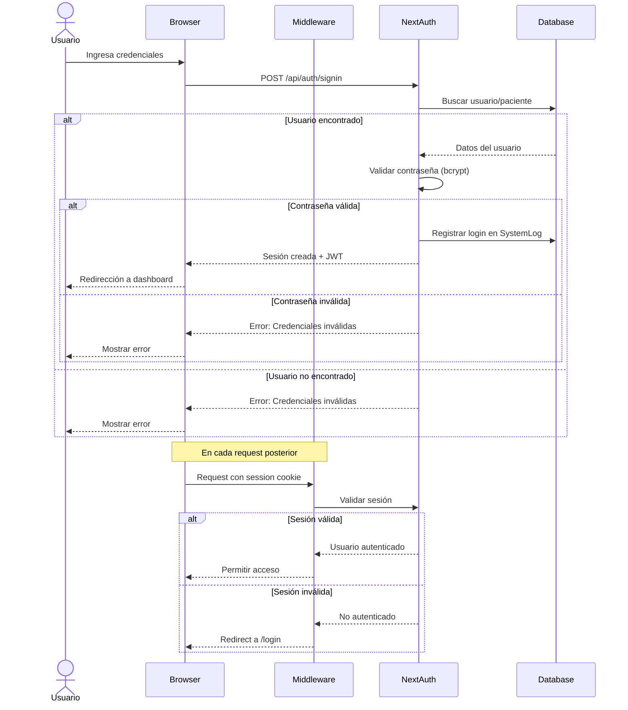

### 5.2 Flujo de Gestión de Pacientes

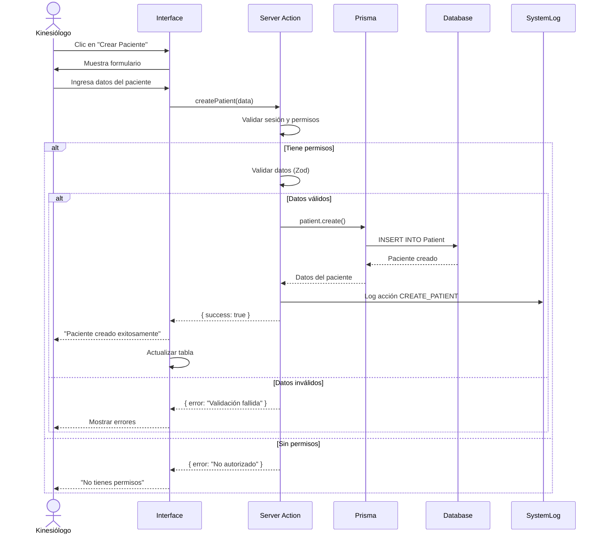

### 5.3 Flujo de Subida de Exámenes

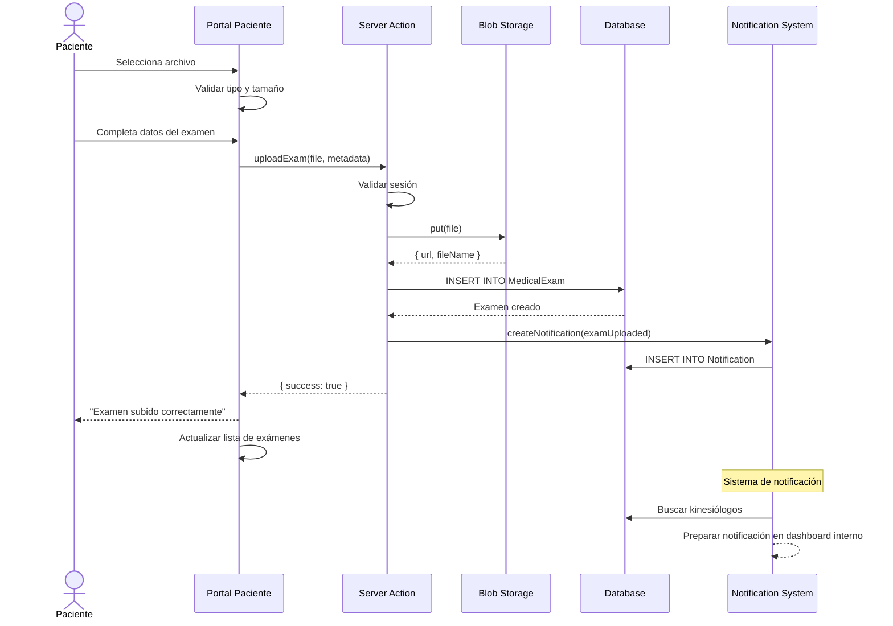

### 5.4 Flujo de Generación de Reportes BI

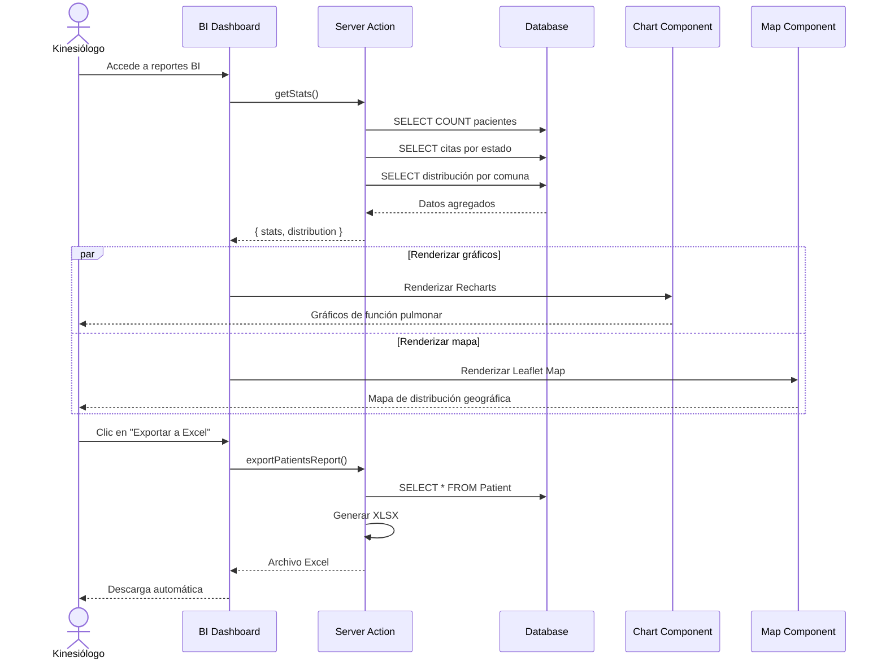

---

## 6. Patrones de Diseño

### 6.1 Patrón Server-Side Rendering (SSR)

Next.js 16 con App Router utiliza **React Server Components** por defecto:

```typescript
// Server Component (default)
async function PatientsPage() {
  const session = await auth();
  const patients = await getPatients();
  
  return <PatientsTable data={patients} />;
}

// Client Component (interactividad)
'use client';
function PatientsTable({ data }) {
  const [filter, setFilter] = useState('');
  // ... lógica cliente
}
```

**Ventajas**:
- SEO mejorado
- Performance (menos JavaScript al cliente)
- Acceso directo a base de datos en server components

### 6.2 Patrón Server Actions

Las **Server Actions** permiten mutaciones sin necesidad de API Routes:

```typescript
'use server';
export async function createPatient(formData: FormData) {
  const session = await auth();
  if (!session) return { error: 'No autorizado' };
  
  // Validación
  const validated = patientSchema.parse(formData);
  
  // Operación DB
  const patient = await prisma.patient.create({
    data: validated
  });
  
  // Log
  await logAction('CREATE_PATIENT', patient.id);
  
  return { success: true, data: patient };
}
```

**Ventajas**:
- Simplicidad (no necesita API route)
- Type-safe (TypeScript end-to-end)
- Revalidación automática de cache

### 6.3 Patrón Repository (Prisma ORM)

Prisma actúa como **Data Access Layer** con type-safety completo:

```typescript
// Operaciones tipadas
const patient = await prisma.patient.findUnique({
  where: { id },
  include: {
    appointments: true,
    exams: true,
    pulmonaryTests: {
      orderBy: { date: 'desc' },
      take: 10
    }
  }
});
```

**Ventajas**:
- Type-safe queries
- Relaciones automáticas
- Migraciones versionadas

### 6.4 Patrón Middleware (Autenticación)

El middleware intercepta requests para validar autenticación:

```typescript
// middleware.ts
export async function middleware(request: NextRequest) {
  const session = await getToken({ req: request });
  
  const isInternalRoute = request.nextUrl.pathname.startsWith('/intranet');
  const isPatientRoute = request.nextUrl.pathname.startsWith('/portal');
  
  if (isInternalRoute && !session?.role) {
    return NextResponse.redirect(new URL('/login', request.url));
  }
  
  if (isPatientRoute && session?.role !== 'patient') {
    return NextResponse.redirect(new URL('/login', request.url));
  }
  
  return NextResponse.next();
}
```

### 6.5 Patrón Singleton (Prisma Client)

```typescript
// lib/prisma.ts
import { PrismaClient } from '@prisma/client';

const globalForPrisma = global as unknown as { prisma: PrismaClient };

export const prisma =
  globalForPrisma.prisma ||
  new PrismaClient({
    log: ['query', 'error', 'warn'],
  });

if (process.env.NODE_ENV !== 'production') globalForPrisma.prisma = prisma;
```

**Ventajas**:
- Evita múltiples instancias en desarrollo (hot reload)
- Pool de conexiones optimizado

---

## 7. Seguridad

### 7.1 Capas de Seguridad

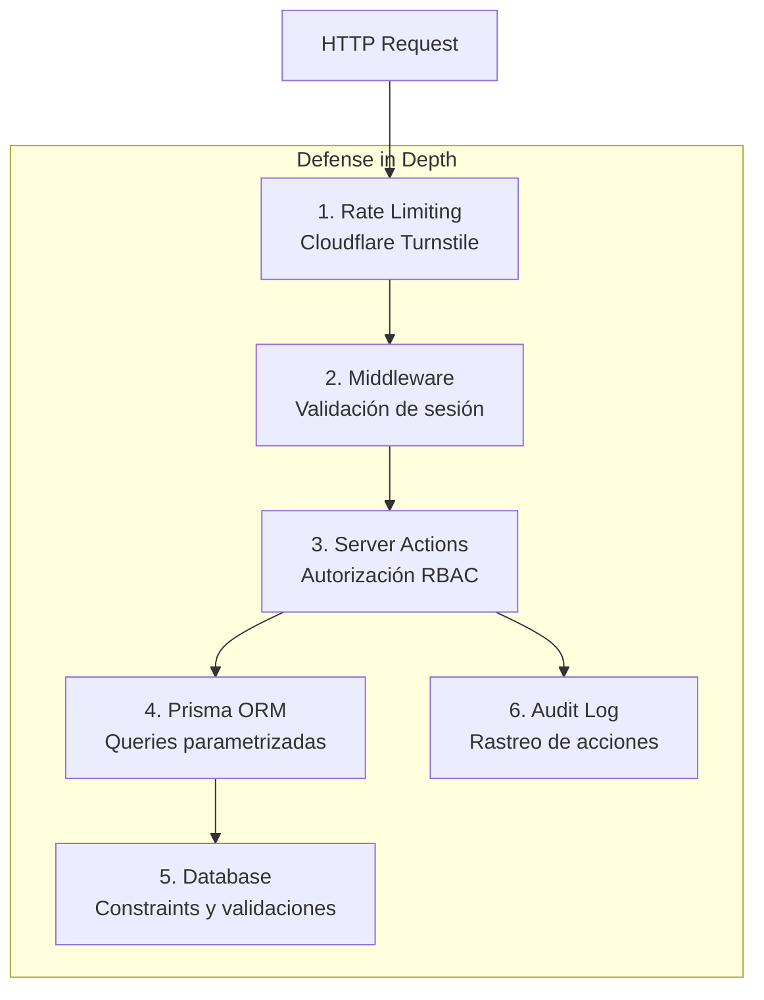

### 7.2 Autenticación (NextAuth.js)

- **Provider**: Credentials (email + password)
- **Session**: JWT almacenado en cookie httpOnly
- **Password hashing**: bcrypt con salt rounds
- **CSRF Protection**: Token automático en formularios

### 7.3 Autorización (RBAC)

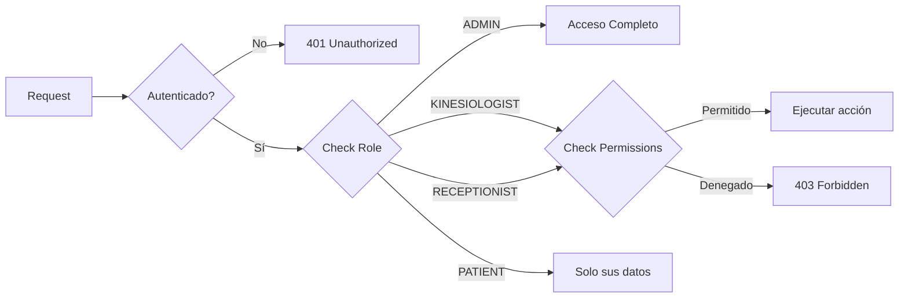

### 7.4 Protección de Datos

- **SQL Injection**: Prevenido por Prisma (queries parametrizadas)
- **XSS**: React escapa automáticamente JSX
- **CSRF**: NextAuth incluye protección
- **File Upload**: Validación de tipo MIME y tamaño
- **Sensitive Data**: Contraseñas nunca en logs, siempre hasheadas

---

## 8. Escalabilidad y Performance

### 8.1 Estrategias de Escalabilidad

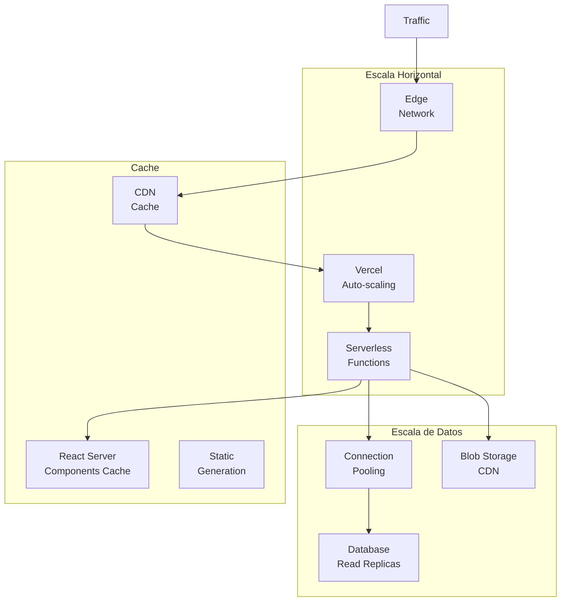

### 8.2 Optimizaciones Implementadas

| Técnica | Implementación | Beneficio |
|---------|----------------|-----------|
| **Static Generation** | Páginas públicas pre-renderizadas | Carga instantánea |
| **Dynamic Imports** | `next/dynamic` | Reducción bundle |
| **Image Optimization** | `next/image` | Lazy loading, WebP |
| **Font Optimization** | `next/font` | Eliminación de FOUT |
| **Database Indexing** | `@@index` en Prisma | Queries rápidas |
| **Connection Pooling** | Prisma + PostgreSQL | Manejo eficiente |
| **Lazy Loading** | React.lazy, Suspense | Mejora TTI |

### 8.3 Métricas de Performance

- **First Contentful Paint (FCP)**: < 1.5s
- **Largest Contentful Paint (LCP)**: < 2.5s
- **Time to Interactive (TTI)**: < 3.5s
- **Cumulative Layout Shift (CLS)**: < 0.1

---

## 9. Deployment y DevOps

### 9.1 Pipeline de Deployment

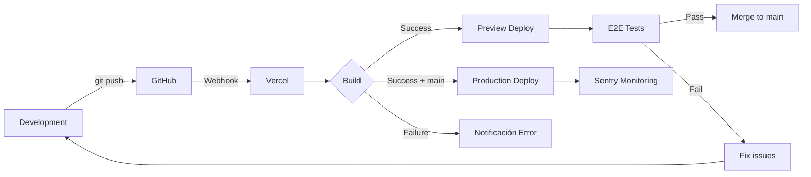

### 9.2 Configuración de Entornos

| Entorno | Base de Datos | Storage | Monitoring |
|---------|---------------|---------|------------|
| **Development** | PostgreSQL local (Docker) | Filesystem | Console logs |
| **Preview** | Neon DB (preview) | Vercel Blob | Sentry (debug) |
| **Production** | Neon/Vercel PostgreSQL | Vercel Blob | Sentry (production) |

### 9.3 Migraciones de Base de Datos

```bash
# Desarrollo
npx prisma migrate dev --name add_feature

# Preview/Production
npx prisma migrate deploy
```

Las migraciones se ejecutan automáticamente en el build script de Vercel.

---

## 10. Monitoreo y Observabilidad

### 10.1 Stack de Monitoreo

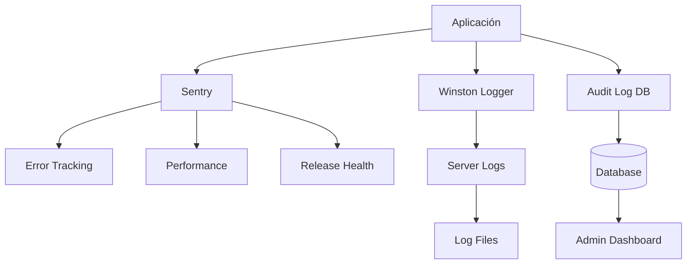

### 10.2 Tipos de Logs

1. **Application Logs** (Winston)
   - Errores del servidor
   - Warnings
   - Info de operaciones

2. **Audit Logs** (Database)
   - Acciones de usuarios
   - Cambios críticos
   - Direcciones IP

3. **Error Tracking** (Sentry)
   - Excepciones no manejadas
   - Performance issues
   - Release tracking

### 10.3 Métricas Clave

- **Uptime**: Disponibilidad del sistema
- **Response Time**: Tiempo de respuesta de API
- **Error Rate**: Tasa de errores
- **User Sessions**: Sesiones activas
- **Database Queries**: Performance de queries

---

## 11. Testing

### 11.1 Estrategia de Testing

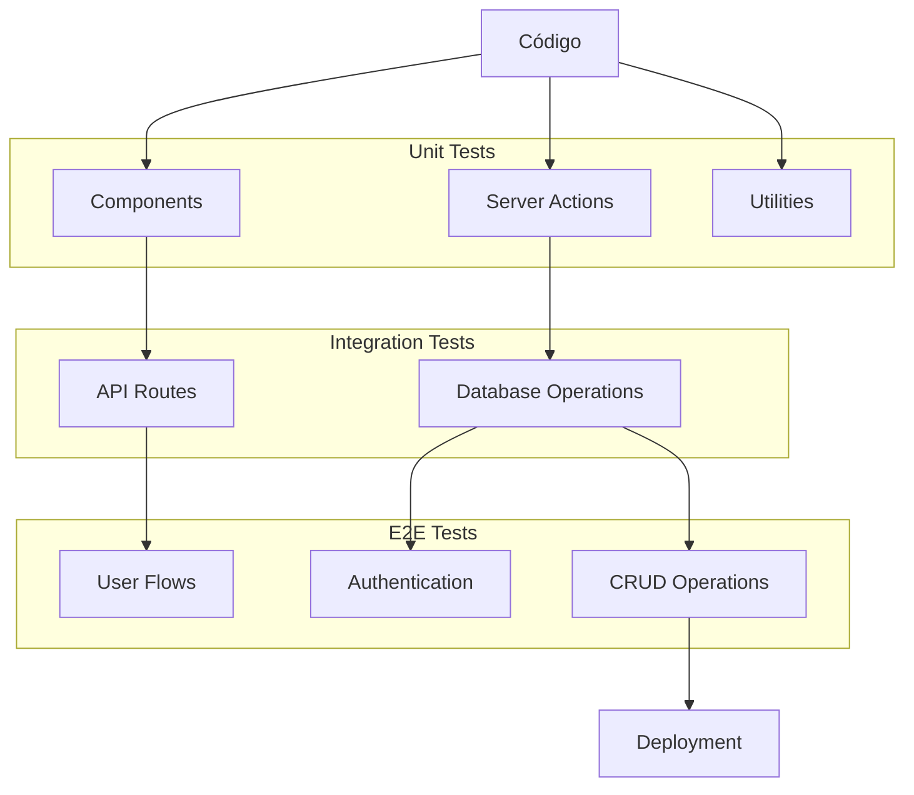

### 11.2 Herramientas de Testing

| Tipo | Herramienta | Cobertura |
|------|-------------|-----------|
| **Unit** | Jest + React Testing Library | Componentes, funciones |
| **E2E** | Playwright | Flujos completos |
| **Visual** | Manual | UI/UX |
| **Performance** | Lighthouse | Core Web Vitals |

### 11.3 Comandos de Testing

```bash
# Unit tests
npm test

# E2E tests
npx playwright test

# Coverage report
npm test -- --coverage
```

---

## 12. Diagrama de Casos de Uso

```mermaid
graph TB
    subgraph "Portal Pacientes"
        P1[Ver Perfil]
        P2[Editar Perfil]
        P3[Agendar Cita]
        P4[Subir Examen]
        P5[Ver Resultados]
        P6[Leer Material Educativo]
    end
    
    subgraph "Portal Interno - Kinesiólogo"
        K1[Gestionar Pacientes]
        K2[Registrar Evaluaciones]
        K3[Revisar Exámenes]
        K4[Ver Reportes BI]
        K5[Analizar Evolución]
    end
    
    subgraph "Portal Interno - Recepcionista"
        R1[Crear Pacientes]
        R2[Ver Pacientes]
        R3[Editar Pacientes]
    end
    
    subgraph "Portal Interno - Admin"
        A1[Gestionar Usuarios]
        A2[Configurar Permisos]
        A3[Ver Auditoría]
        A4[Gestionar Contenido]
    end
    
    Patient((Paciente)) --> P1
    Patient --> P2
    Patient --> P3
    Patient --> P4
    Patient --> P5
    Patient --> P6
    
    Kine((Kinesiólogo)) --> K1
    Kine --> K2
    Kine --> K3
    Kine --> K4
    Kine --> K5
    
    Recep((Recepcionista)) --> R1
    Recep --> R2
    Recep --> R3
    
    Admin((Administrador)) --> A1
    Admin --> A2
    Admin --> A3
    Admin --> A4
    Admin --> K1
    Admin --> K4
```

---

## 13. Resumen Técnico

### 13.1 Decisiones Arquitectónicas Clave

1. **Next.js 16 con App Router**: Máximo performance con React Server Components
2. **Serverless en Vercel**: Escalabilidad automática sin gestión de infraestructura
3. **PostgreSQL con Prisma**: Type-safety y migraciones versionadas
4. **NextAuth.js**: Autenticación robusta y flexible
5. **Vercel Blob**: Storage escalable para archivos médicos
6. **Sentry**: Monitoring proactivo de errores

### 13.2 Trade-offs

| Decisión | Ventaja | Desventaja |
|----------|---------|------------|
| Serverless | Auto-scaling, sin ops | Cold starts ocasionales |
| Prisma ORM | Type-safe, productividad | Abstracción sobre SQL |
| Monolito Next.js | Simplicidad, performance | Menos separación de concerns |
| Vercel Blob | Integración perfecta | Vendor lock-in |

### 13.3 Evolución Futura

**Posibles mejoras**:
- Microservicios para módulos específicos (reporting, analytics)
- WebSockets para notificaciones en tiempo real
- GraphQL para queries más flexibles
- Redis cache para datos frecuentes
- Kubernetes para más control de infraestructura

---

**Documento de Arquitectura v1.0**  
*Sistema de Gestión Broncopulmonar*  
*Actualizado: 20 de Enero, 2026*
